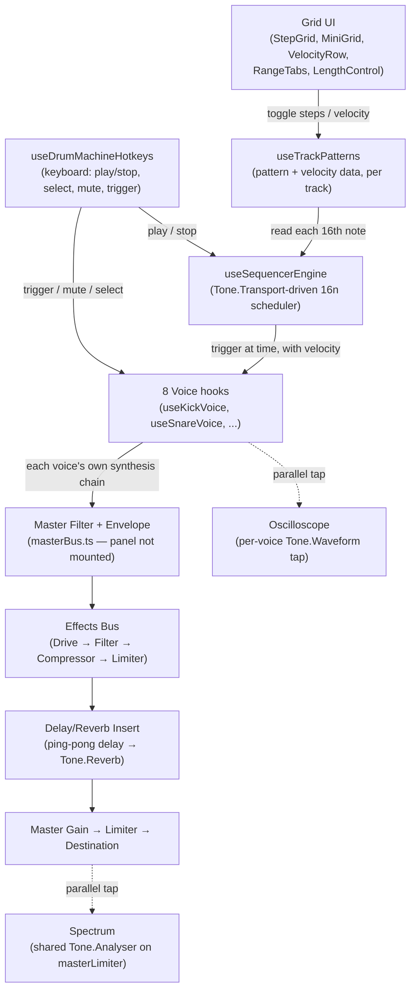

# Boomshakabox — Architecture Spec

A browser-based drum machine: an 8-track, up-to-64-step sequencer with
per-voice synthesis (no samples — every sound is built from Tone.js
oscillators/noise/filters at trigger time), a shared effects chain, and
real-time waveform/spectrum visualizers. Built with React 19 + TypeScript +
Tone.js, styled with `@cutoff/audio-ui-react` (knobs/sliders) and Linaria
(everything custom).

This document describes the app **as it currently exists in code**. Where
something was planned but isn't actually wired into the live UI, that's
called out explicitly rather than described as if it were shipped.

## High-level signal & control flow



## Voice architecture

Eight voices, each a `use<X>Voice` hook (`src/components/voices/<name>/`)
paired with a presentational `<X>Pad` component:

| Voice | Hook | Source |
| --- | --- | --- |
| Kick | `useKickVoice` | `MembraneSynth` + `NoiseSynth` click layer |
| Snare | `useSnareVoice` | 2× triangle oscillator + white noise |
| Clap | `useClapVoice` | white noise, split into tail + multi-pulse burst |
| Hi-Hat (Closed) | `useHiHatVoice` | 6× fixed-frequency square oscillator bank |
| Hi-Hat (Open) | `useHiHatOpenVoice` | same oscillator bank as Closed, longer decay |
| Hi Tom | `useHiTomVoice` | 1× sine oscillator with pitch drop |
| Mid Tom | `useMidTomVoice` | same shape as Hi Tom, different tone range |
| Low Tom | `useLowTomVoice` | same shape as Hi Tom, different tone range |

Every voice's full signal chain and per-knob mapping is documented in its
own folder's `README.md` (linked from the root `README.md`'s Documentation
index) with a mermaid diagram — this doc only covers the pattern shared
across all of them, not per-voice detail.

**Shared pattern, every voice:**

- A `buildAndTrigger<X>` function builds the **entire node graph fresh on
  every trigger call**, and disposes it afterward (`setTimeout(dispose,
  ...)`, sized to the voice's own envelope duration). This is a deliberate,
  app-wide choice — not the "build once, reuse forever" approach a
  persistent-synth architecture would use — traded for direct portability
  of each voice's original hand-tuned Web Audio recipe, and because
  disposal happens well after the moment that matters for playback timing.
  If per-hit construction cost ever becomes a real problem (many
  simultaneous long-decay voices at high tempo), the fix is converting the
  hot ones to persistent node graphs with an imperative `trigger(time,
  params)` that only touches already-existing nodes.
- Each voice exposes the same base return shape: its own knobs (unique per
  voice), plus `volume`, `pan`, `muted`, `soloed`, `pressed`, `trigger`,
  `waveformRef`, `renderFullWaveform` — this uniform shape is what lets
  `useVoices` (`components/voices/useVoices.ts`) compose all eight into one
  `Record<TrackId, Voice>` and what lets `VoicePadRow`/`VoiceScope`/
  `VoiceParamsTable` treat every voice identically.
- **Level** is computed via the shared `computeLevel(muted, volume,
  velocity)` helper (`lib/voiceLevel.ts`) — mute zeroes it, volume and
  per-step velocity both scale it 0–1.
- **Oscilloscope tap**: every voice's panner also connects (in parallel,
  not inline) to a `Tone.Waveform` from `useScopeWaveform`
  (`lib/voiceScope.ts`), which is what the oscilloscope reads live — see
  [`sequencer/oscilloscope/README.md`](../src/sequencer/oscilloscope/README.md).
- **Three of the eight** (Hi Tom, Mid Tom, Low Tom) are structurally
  identical code, differing only in their tone-range constants — see any
  one's README for the shared shape.

## Sequencer engine

Composed in `useStepSequencer` (`sequencer/grid/useStepSequencer.ts`) from
five separately-testable hooks:

- **`useTrackPatterns`** (`sequencer/engine/useTrackPatterns.ts`) — owns the
  actual pattern data: a `boolean[]` and a `number[]` (velocity) per track,
  each `MAX_STEPS` (64) long, kept in a `useRef` (read by the scheduler) with
  a paired `useState` mirror (`patternsDisplay`/`velocitiesDisplay`, for
  React to render from). Also owns `selectedTrack` — which track's pattern
  is currently visible/editable in the grid.
- **`useGridPaging`** (`sequencer/grid/useGridPaging.ts`) — the pattern
  *length* (16/32/48/64 steps, `PATTERN_LENGTH_OPTIONS`) and which 16-step
  "page" of that length is currently viewed (`viewedRange`), independent of
  which steps are actually programmed.
- **`useSequencerEngine`** (`sequencer/engine/useSequencerEngine.ts`) — the
  actual playback: a single `Tone.getTransport().scheduleRepeat(..., "16n")`
  walks a step counter modulo the current pattern length, and for every
  track whose pattern has that step on, calls `voices[id].trigger(time,
  velocity)`. UI-side state (`currentStep`) is set inside
  `Tone.getDraw().schedule(...)`, not directly from the scheduler callback —
  this is what keeps the visual playhead in sync with actual audio timing
  rather than drifting from React's own render/effect timing.
- **`useMiniGridFollow`** (`sequencer/grid/useMiniGridFollow.ts`) — the
  32-step-wide `MiniGrid` overview's own "which half am I looking at" state,
  which auto-follows the playhead by default but switches to manual once the
  user explicitly picks a range, resuming auto-follow only if they pick the
  range the playhead is already in.
- **`useSequencerHitFlash`** (`sequencer/engine/useSequencerHitFlash.ts`) —
  a short (60ms) per-track "did this track just hit" flag, driven by the
  engine's `onStepHit` callback, purely for the trigger-button flash
  visual — has no effect on audio or pattern data.

**Pattern data lives in a ref, not `useState`**, because the scheduler
callback needs to read whatever was most recently written synchronously —
`useState` updates are batched/async and aren't guaranteed current at the
moment a scheduled audio callback fires. The paired `useState` mirror exists
purely so the grid UI has something to re-render from.

## Hotkeys

`useDrumMachineHotkeys` (`sequencer/useDrumMachineHotkeys.ts`), via
`react-hotkeys-hook`:

| Keys | Action |
| --- | --- |
| `Space` | Play/Pause (resumes from current position) |
| `Escape` | Stop (resets playhead to bar 1) |
| `1`–`8` | Select voice (same order as the pad row) |
| `Shift+1`–`8` | Toggle mute on that voice, without changing selection |
| `A S D F G H J K` | Trigger that voice directly — goes through the same `trigger()` a pad click uses |

Disabled while a text field (e.g. the BPM input) is focused, via
`react-hotkeys-hook`'s default `enableOnFormTags: false`.

## Effects / master bus chain

Every voice connects to `masterBusInput`, which is the start of a fixed
chain ending at `Tone.Destination`:

```
masterBusInput (masterFilter)
  → Effects Bus (Drive → Filter → Compressor → Limiter)
  → Delay/Reverb Insert (ping-pong delay → Tone.Reverb)
  → Master Gain → Master Limiter → Destination
```

Each stage has its own detailed README under [`DOCS/buses/`](./buses/):

- [`buses/master-bus.md`](./buses/master-bus.md) — the master filter (with
  a per-hit-triggered envelope) and the final gain/limiter. **Note:** this
  filter's own control panel (`FilterPanel`) is not currently mounted
  anywhere in the app — see that doc for detail.
- [`buses/effects-bus.md`](./buses/effects-bus.md) — Drive → Filter →
  Compressor → Limiter; the Cutoff/Res/Drive knobs on `EffectsPanel`.
- [`buses/delay-reverb-insert.md`](./buses/delay-reverb-insert.md) — the
  hand-built ping-pong delay and `Tone.Reverb`; the Rate/Time/Verb knobs on
  `EffectsPanel`.

## Visualizers

- **Oscilloscope** (`sequencer/oscilloscope/`) — per-voice, live +
  full-envelope waveform views for whichever track is currently selected.
  See [`sequencer/oscilloscope/README.md`](../src/sequencer/oscilloscope/README.md).
- **Spectrum** (`sequencer/spectrum/`) — a single real-time frequency
  display for the whole kit, tapped off the master bus post-limiter. See
  [`sequencer/spectrum/README.md`](../src/sequencer/spectrum/README.md).

## Not currently implemented / not live

- **`FilterPanel`** (master filter's own UI) exists and is fully wired to a
  live node in the signal path, but isn't imported/rendered anywhere in the
  app — see the master-bus note above.
- **An ADSR envelope component** (`src/components/adsr/`) exists but is
  entirely commented out in `App.tsx`, with an explicit note that it isn't
  wired to any drum voice. It's a standalone prototype, not part of the live
  app, and isn't otherwise documented here.
