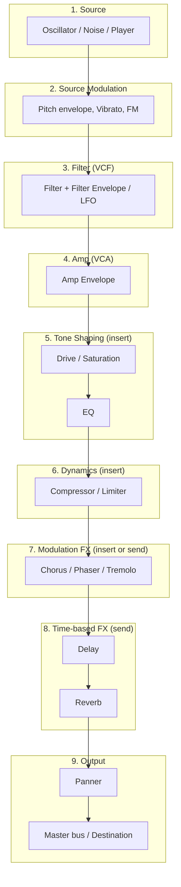
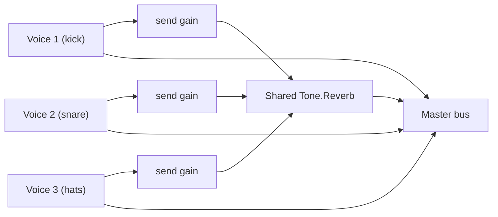

# Tone.js Signal Flow: What Order Do Nodes Go In?

A reference for the conventional order to chain Tone.js nodes when building a
sound — source, then shape it, then send it to the mix. There's no single
"correct" order enforced by the API (you can `.connect()` anything to
anything), but most synth voices and effect chains converge on the same
general pipeline because each stage depends on the one before it making
sense yet. This doc lays out that default order, why it's the default, and
where it's fine to deviate.

## The pipeline, at a glance

| #   | Stage                 | Typical Tone.js nodes                                                                                                                   | Role                                                                                                                                                                                                                                                                                     |
| --- | --------------------- | --------------------------------------------------------------------------------------------------------------------------------------- | ---------------------------------------------------------------------------------------------------------------------------------------------------------------------------------------------------------------------------------------------------------------------------------------- |
| 1   | Source                | `Tone.Oscillator`, `Tone.Noise`, `Tone.Player`, or a full instrument (`Tone.MembraneSynth`, `Tone.NoiseSynth`)                          | Generates the raw waveform. Nothing downstream has anything to work with until this exists.                                                                                                                                                                                              |
| 2   | Source modulation     | `Tone.FrequencyEnvelope` / manual `.frequency` automation (pitch drop), `Tone.Vibrato`, FM (one oscillator into another's `.frequency`) | Shapes the source's pitch _before_ anything else touches it — a kick's pitch-drop punch, or vibrato, is a property of the note itself, not an effect applied afterward.                                                                                                                  |
| 3   | Filter (VCF)          | `Tone.Filter`, `Tone.AutoFilter` (LFO-modulated filter)                                                                                 | Carves the raw waveform's harmonic content. Comes before the amp stage because "how bright is this sound" is a tone-color decision, independent of "how loud is it right now."                                                                                                           |
| 4   | Amp (VCA)             | `Tone.AmplitudeEnvelope`, or a `Tone.Gain` with manual ADSR automation (what this project's raw components use)                         | The primary loudness envelope — attack/decay/sustain/release. This is the last stage that's really part of "the voice itself"; everything after this is processing applied to the finished note.                                                                                         |
| 5   | Tone shaping (insert) | `Tone.Distortion`, `Tone.Chebyshev`, `Tone.BitCrusher`, `Tone.EQ3`                                                                      | Insert effects that further color the signal per-voice. Drive/distortion is genuinely flexible here — see "Where order is a creative choice" below — but placing it after the amp envelope means it reacts to the note's natural decay rather than distorting a flat, un-enveloped tone. |
| 6   | Dynamics (insert)     | `Tone.Compressor`, `Tone.Limiter`                                                                                                       | Controls peaks and glues elements together. Belongs after tone-shaping because distortion/EQ can change the peak levels a compressor needs to react to.                                                                                                                                  |
| 7   | Modulation FX         | `Tone.Chorus`, `Tone.Phaser`, `Tone.Tremolo`, `Tone.AutoPanner`                                                                         | Adds movement/width. Usually comes after the signal's tone and dynamics are settled, so the modulation is shaping a finished sound rather than being altered again by EQ/compression afterward.                                                                                          |
| 8   | Time-based FX         | `Tone.FeedbackDelay`/`Tone.PingPongDelay`, then `Tone.Reverb`/`Tone.Convolver`                                                          | Delay is conventionally placed _before_ reverb, so the echoes also get room ambience on them, which reads as more natural than reverb tails being echoed without their own space.                                                                                                        |
| 9   | Output                | `Tone.Panner`/`Tone.PanVol`, then `Tone.Destination` (optionally through a master `Tone.Limiter` and `Tone.Volume`)                     | Final positioning and the master bus everything converges on.                                                                                                                                                                                                                            |

## Where order is a creative choice, not a rule

- **Drive/saturation before vs. after the filter.** Distorting _before_ the
  filter feeds the filter extra harmonics to carve — a classic "aggressive
  bass" technique. Distorting _after_ the filter shapes only the harmonics
  the filter already decided to keep, for a cleaner, more controlled grit.
  Both are common; there's no universal right answer, only what you're going
  for.
- **Drive before vs. after the amp envelope.** This project's kick
  components put `Tone.Distortion` _before_ the amp envelope
  (`osc → saturation → makeupGain → ampGain`, see
  [ToneKickButton.tsx](src/components/ToneKickButton.tsx)) — the drive
  character is baked into the raw tone before it's shaped into a decaying
  hit. Putting it after the amp envelope instead would mean the decay tail
  itself gets progressively less saturated as it gets quieter (since
  waveshaping is level-dependent — see
  [WEB-AUDIO-API-DRUM-MACHINE-MAP.md](WEB-AUDIO-API-DRUM-MACHINE-MAP.md)'s
  saturation section), which is a legitimately different, also-valid sound.
- **Delay before vs. after reverb.** Reverb-then-delay (echoes of an
  already-reverberant signal) also has real production use — it's just less
  common as a default than delay-then-reverb.

## Insert vs. send: the one structural choice that _does_ matter

Everything in the table above is written as a straight chain (an **insert**
— the signal passes through the node once, fully wet or dry-mixed within the
node itself, e.g. `Tone.Distortion`, `Tone.EQ3`, `Tone.Filter`). Time-based
effects like `Tone.Reverb` and `Tone.FeedbackDelay` are usually treated
differently in a real project: as a **send** — one shared effect instance
that multiple voices route into via their own small `Tone.Gain`, rather than
each voice constructing its own reverb/delay node.

This matters because `Tone.Reverb` is a convolution node — genuinely
expensive to compute. Constructing a fresh one per drum hit (the way this
project's components construct a fresh `Tone.Distortion`/`Tone.Filter` per
trigger, which is cheap) would create and tear down a costly node on every
single hit. If/when reverb gets added to this project, it should be built
once (outside the trigger function, e.g. via a ref or module-level constant)
and shared across every voice via sends, not instantiated inside
`triggerKick`/`triggerSnare` alongside the cheap per-voice nodes.

## How this project's current components fit the pipeline

| Component                                                 | Stage 1 (Source)                                             | Stage 3 (Filter)                                                  | Stage 4 (Amp)                                   | Stage 5 (Tone shaping)                 |
| --------------------------------------------------------- | ------------------------------------------------------------ | ----------------------------------------------------------------- | ----------------------------------------------- | -------------------------------------- |
| [ToneSnareButton.tsx](src/components/ToneSnareButton.tsx) | `Tone.Oscillator` ×2 (tone voice), `Tone.Noise` (snap voice) | `Tone.Filter` (highpass, snap voice only)                         | `Tone.Gain` ×2 (manual envelope, one per voice) | —                                      |
| [ToneKickButton.tsx](src/components/ToneKickButton.tsx)   | `Tone.Oscillator` (sine, with pitch-drop)                    | — (no VCF; the pitch envelope does the tone-shaping work instead) | `Tone.Gain` (manual envelope)                   | `Tone.Distortion` + makeup `Tone.Gain` |

Neither component uses stages 6–9 yet (dynamics, modulation FX, time-based
FX, panning) — those are the natural next additions if this project grows
toward a fuller drum-voice chain, and the send-vs-insert distinction above is
the main thing to get right before adding them.
