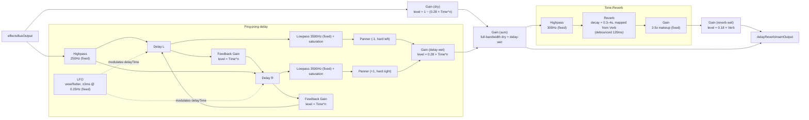

# Delay/Reverb Insert

`src/lib/delayReverbInsert.ts`, controlled by `useDelayReverbBus`
(`src/components/effects/useDelayReverbBus.ts`) and rendered as the Rate/
Time/Verb knobs on `EffectsPanel`. Takes `effectsBusOutput` (see
[effects-bus.md](./effects-bus.md)) as its input and its own
`delayReverbInsertOutput` feeds `masterGain` (see
[master-bus.md](./master-bus.md)) — it sits between the two, after the
Filter/Drive stages and before the final master gain/limiter.

A hand-built tape-style ping-pong delay (not `Tone.PingPongDelay`, so the
cross-feed/darkening/grit character is tunable), followed by `Tone.Reverb`
(a convolution reverb, chosen after A/B/C listening against `Tone.Freeverb`
and `Tone.JCReverb`).

## Signal flow

_"Time" above is the Feedback knob's raw 0–1 value; "Verb" is the Verb
Length knob's raw 0–1 value. `n` is `FEEDBACK_CURVE_EXPONENT`, currently `1`
(linear) — see Notes below._

## Knobs

| Knob     | Range      | Controls                                                              |
| -------- | ---------- | ------------------------------------------------------------------------ |
| Rate     | 8 steps    | Delay time, quantized to note divisions (see below)                       |
| Time     | 0–1        | Feedback amount — doubles as the delay's overall presence (0 = fully silent) |
| Verb     | 0–1        | Reverb decay length (via `Tone.Reverb.decay`) — doubles as overall presence (0 = fully off) |

Rate's 8 steps, in order: `1/16, 1/8t, 1/8, 1/4t, 1/8., 1/4, 1/4., 1/2` —
ordered by actual resulting duration (triplets land between their
neighboring straight/dotted values), not by note-name grouping, so the knob
sweeps delay time monotonically. Delay time re-resolves against the current
BPM whenever it changes (polled every 150ms, since `Tone.Transport.bpm` has
no change event to subscribe to).

## Notes

- **Genuine ping-pong, not just cross-feed**: each delay line's wet tap is
  hard-panned to an opposite extreme (-1/+1) *before* summing — cross-feed
  routing alone (L's feedback into R's line and vice versa) isn't sufficient
  for an audible left/right alternation; without the explicit panning, both
  taps would collapse to a centered image.
- **Only the left line receives the dry input directly.** The right line
  only ever receives signal via the left line's feedback path. If both
  lines received the dry input directly, every repeat interval would emit
  simultaneous hard-L and hard-R copies of the same content at the same
  time — which reads as a widened center image, not alternating repeats,
  and gets worse as feedback accumulates more of these simultaneous pairs.
- **Darkening happens before the wet/feedback split**, not only inside the
  feedback loop — so even the very first repeat is already darkened, not
  just the ones that have looped through feedback at least once.
- **Feedback (Time)'s raw 0–1 value is passed through a curve exponent**
  (`FEEDBACK_CURVE_EXPONENT`) before being applied anywhere — currently `1`
  (linear). A higher exponent (cubing was tried during tuning) concentrates
  the feedback loop's instability toward the top of the knob's range
  instead of the midpoint; adjust this one constant to retune the feel.
- **Feedback/Verb double as overall presence**, not just regeneration
  amount/decay length — at 0, both the delay and reverb are fully silent,
  compensated by the dry gain rising to fill the level. This was a
  deliberate fix; the naive version left one audible repeat/short tail even
  at the knob's minimum.
- **The reverb is a side-chain, not an inline stage**: `preReverbSum` (the
  full-bandwidth dry+delay signal) connects directly to
  `delayReverbInsertOutput`, unfiltered. The reverb's highpass and
  `Tone.Reverb` itself sit on a parallel branch off the same
  `preReverbSum`, and only *that* branch's output gets summed back in. This
  matters because `Tone.Reverb`'s own internal wet/dry blend uses its own
  (already-highpassed) input as its "dry" portion — routing the main signal
  through it directly would have stripped low end from the entire kit, not
  just the reverb tail.
- **`Tone.Reverb`'s only control is `decay`** (seconds) — a plain setter
  that triggers an async offline impulse-response re-render on every
  change, unlike a live-rampable Signal. Verb Length maps onto a 0.3–4s
  range and is debounced by 120ms so dragging the knob doesn't fire a
  render on every tick.
- **The 2.5x makeup gain on the reverb** compensates for `Tone.Reverb`'s
  convolution output reading quieter than an algorithmic reverb's sustained
  feedback would at a comparable decay length — a tuned-by-reasoning
  starting point, not something confirmed by ear in a browser.
- **`Tone.Freeverb` and `Tone.JCReverb` were both built and A/B/C-compared
  against `Tone.Reverb` here before this reverb stage was finalized** — they
  were removed once `Tone.Reverb` won; no dead code or engine-switcher was
  left behind from that comparison.
