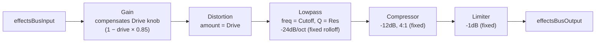

# Effects Bus

`src/lib/effectsBus.ts`, controlled by `useEffectsBus`
(`src/components/effects/useEffectsBus.ts`) and rendered as the Cutoff/Res/
Drive knobs on `EffectsPanel` (`src/components/effects/EffectsPanel.tsx`).

A drive-then-filter coloration stage, followed by a fixed compressor/limiter
safety net. Every voice's output converges here (each voice connects to
`masterBusInput` in `masterBus.ts`, which in turn feeds this bus's input —
see [master-bus.md](./master-bus.md)) before reaching the delay/reverb
insert and the master gain.

## Signal flow

## Knobs

| Knob   | Range        | Controls                                                        |
| ------ | ------------ | ------------------------------------------------------------------ |
| Cutoff | 20–12000 Hz  | `effectsFilter.frequency`                                          |
| Res    | 0.1–20       | `effectsFilter.Q`                                                   |
| Drive  | 0–1          | `effectsDrive.distortion`, with `effectsDriveTrim` gain compensating (ramps down to 15% as Drive maxes out) so cranking Drive doesn't also blow up level |

## Notes

- **Fixed stages**: the filter's -24dB/octave rolloff, and the compressor/
  limiter's thresholds/ratios, are not exposed — only Cutoff, Res, and Drive
  are user-facing.
- **Drive-then-filter order**: distortion is applied *before* the filter, so
  turning Cutoff down also tames any harshness Drive adds — they interact,
  which is intentional (this is the conventional drive→filter order, not
  filter→drive).
- **Downstream**: `effectsBusOutput` feeds the delay/reverb insert — see
  [delay-reverb-insert.md](./delay-reverb-insert.md) — not the master gain
  directly.
- **Distinct from the master bus's own filter**: this is a separate filter
  from `masterFilter` in `masterBus.ts` (see [master-bus.md](./master-bus.md))
  — two independent lowpass stages exist in the chain, at different points,
  with different knobs.
