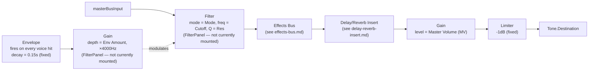

# Master Bus

`src/lib/masterBus.ts`. The final stage of the signal path: every voice
connects to `masterBusInput` (the entry point), and the chain ends at
`masterLimiter.toDestination()`.

Two separate control surfaces tap into this file: `useMasterBus`
(`src/components/master/useMasterBus.ts`, rendered as `MasterPanel`'s "MV"
knob) controls the final gain stage, and `useFilterBus`
(`src/components/filter/useFilterBus.ts`, rendered as `FilterPanel`)
controls the filter + its envelope.

> **Not currently reachable in the UI.** `FilterPanel` exists and is fully
> wired to `masterFilter`, but it is never imported/rendered anywhere in the
> app (confirmed by searching the whole `src` tree) — there is currently no
> way for a user to turn the filter's Cutoff/Res/Mode/Env Amount knobs. The
> filter itself and its envelope trigger *are* live in the signal path
> below regardless (every voice hit calls `triggerMasterFilterEnvelope`),
> so this isn't dead code — it's just orphaned from its own panel. At the
> defaults it ships with (Cutoff wide open at 12000Hz, Env Amount 0), it has
> no audible effect, which is presumably why this has gone unnoticed.

## Signal flow

## Knobs

| Knob             | Panel        | Range        | Controls                                                    |
| ----------------- | ------------ | ------------ | ------------------------------------------------------------ |
| Cutoff            | Filter *(unmounted)* | 20–12000 Hz | `masterFilter.frequency`                        |
| Res               | Filter *(unmounted)* | 0.1–20      | `masterFilter.Q`                                |
| Mode              | Filter *(unmounted)* | LP/BP/HP    | `masterFilter.type`                             |
| Env Amount        | Filter *(unmounted)* | -1–1        | Depth of the per-hit envelope's modulation onto the filter's frequency (±4000Hz at the extremes) |
| MV (Master Volume) | Master      | 0–100%      | `masterGain.gain`                                            |

## Notes

- **The filter envelope fires on every hit of every voice**, not per-track —
  each voice's `trigger()` calls `triggerMasterFilterEnvelope(now)`
  (de-duplicated by scheduled time, so simultaneous hits on the same step
  only trigger it once). With Env Amount at its default of 0, this has no
  audible effect regardless.
- **This is a different filter from the Effects Bus's own filter** — see
  [effects-bus.md](./effects-bus.md). `masterFilter` sits *before* the
  effects bus in the chain; `effectsFilter` sits inside it.
- **`masterGain` defaults to 0.75** (75%), matching the 75% default most
  voices' own Volume knobs ship with — several voices' fixed output-makeup
  constants (see e.g. Kick's README) were tuned assuming both defaults.
