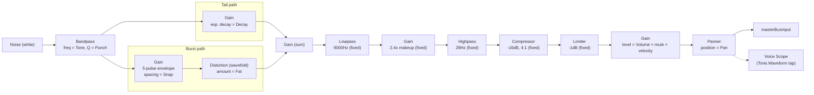

# Clap

`useClapVoice` (`useClapVoice.ts`) pairs with `ClapPad` (`ClapPad.tsx`). A
single white-noise source feeds a shared bandpass filter, which then splits
into two parallel envelope paths — a single-decay "tail" and a multi-pulse
"burst" — before they sum and pass through the same fixed output stage Kick
uses (lowpass → makeup → highpass → compressor → limiter).

## Signal flow

## Knobs

| Knob   | Range      | Controls                                                        |
| ------ | ---------- | ------------------------------------------------------------------ |
| Tone   | 800–1600 Hz| Bandpass center frequency, shared by both paths                    |
| Punch  | 1–8        | Bandpass Q, shared by both paths                                   |
| Decay  | 0.1–3s     | Tail path's exponential decay — the "room" ring-out                |
| Snap   | 0–1        | Spacing between the burst's 5 pulses (higher = tighter/"flam")      |
| Fat    | 0–1        | Wavefold distortion amount, burst path only                        |
| Volume | 0–100%     | Final gain stage, post-limiter                                     |
| Pan    | -100–100   | Stereo position, shared by both paths                              |

## Notes

- **Burst shape is otherwise fixed**: pulse count (5), attack/decay per
  pulse (1ms/12ms), and the "chaotic-then-regular" jitter (randomized timing
  and amplitude on only the first 2 pulses, settling to an exact grid after)
  are all fixed constants — only the pulse-to-pulse spacing (Snap) and the
  overall wavefold amount (Fat) are user-facing.
- **Randomized per hit**: the burst's jitter uses `Math.random()` at trigger
  time, so consecutive hits with identical knob settings won't sound
  byte-identical — this is intentional (mimics real clap-pack variation),
  not a bug.
- **Shares its output stage's exact constants with Kick** (same lowpass/
  makeup/highpass/compressor/limiter values) — not derived from a shared
  helper, just tuned to match.
- **Per-hit node construction**: like every voice in this app, the full
  chain above is built fresh on each hit and disposed afterward.
