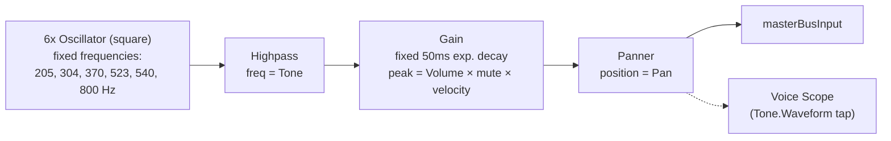

# Hi-Hat (Closed)

`useHiHatVoice` (`useHiHatVoice.ts`) pairs with `HiHatPad` (`HiHatPad.tsx`).
A bank of six fixed-frequency square oscillators (an approximation of a
classic drum machine's metallic hex/hi-hat bank, shared verbatim with the
Open Hi-Hat voice) feeds a single highpass filter and a fixed-decay
amplitude envelope.

## Signal flow

## Knobs

| Knob   | Range         | Controls                                    |
| ------ | ------------- | -------------------------------------------- |
| Tone   | 3000–10000 Hz | Highpass cutoff, post-oscillator bank         |
| Volume | 0–100%        | Envelope peak level                           |
| Pan    | -100–100      | Stereo position                               |

## Notes

- **The 50ms decay is fixed, not a knob** — this is what makes the voice
  read as "closed" rather than a ringing open hat. `useHiHatOpenVoice`
  reuses this exact same graph shape but exposes that decay as a knob
  instead — see its README.
- **The oscillator frequency bank** (`HI_HAT_OSCILLATOR_FREQUENCIES` in
  `lib/hiHatOscillatorFrequencies.ts`) is a shared constant, reused
  identically by both hi-hat voices — the metallic character comes entirely
  from this fixed bank, not from anything user-facing.
- **Per-hit node construction**: like every voice in this app, the full
  chain above is built fresh on each hit and disposed afterward.
