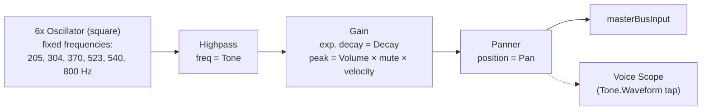

# Hi-Hat (Open)

`useHiHatOpenVoice` (`useHiHatOpenVoice.ts`) pairs with `HiHatOpenPad`
(`HiHatOpenPad.tsx`). Structurally identical to the Closed Hi-Hat voice —
same fixed oscillator bank, same highpass — with one difference: the
envelope decay is a user-facing knob instead of a fixed 50ms, giving it a
ringing "open" tail.

## Signal flow

## Knobs

| Knob   | Range         | Controls                                    |
| ------ | ------------- | -------------------------------------------- |
| Tone   | 3000–10000 Hz | Highpass cutoff, post-oscillator bank         |
| Decay  | 0.2–1s        | Envelope decay — the "ring" of the open hat    |
| Volume | 0–100%        | Envelope peak level                           |
| Pan    | -100–100      | Stereo position                               |

## Notes

- **Same fixed oscillator bank as the Closed Hi-Hat** —
  `HI_HAT_OSCILLATOR_FREQUENCIES` in `lib/hiHatOscillatorFrequencies.ts`,
  shared verbatim. All the tonal/metallic character comes from this bank;
  the only structural difference from the closed voice is Decay being a
  knob here instead of a fixed 50ms.
- **Per-hit node construction**: like every voice in this app, the full
  chain above is built fresh on each hit and disposed afterward.
