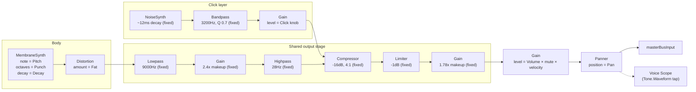

# Kick

`useKickVoice` (`useKickVoice.ts`) pairs with the presentational `KickPad`
(`KickPad.tsx`). Like every voice, its full node graph is built fresh on
each `trigger()` call (see the [Voice architecture](../../../../DOCS/ARCHITECTURE-SPEC.MD#voice-architecture)
section of the architecture spec for why) inside `buildAndTriggerKick`,
then disposed after playback.

The kick body is a `Tone.MembraneSynth`; a separate `Tone.NoiseSynth` click
layer joins the chain partway through and shares the body's output stage.

## Signal flow

The click layer bypasses the body's Distortion/Lowpass — it joins the shared
chain directly at the Compressor, so it's shaped only by the fixed
highpass/compressor/limiter stage, not by the body's own tone-shaping.

## Knobs

| Knob    | Range               | Controls                                                    |
| ------- | ------------------- | ------------------------------------------------------------ |
| Pitch   | 34–72 Hz            | `MembraneSynth`'s triggered note                              |
| Punch   | 2–9                 | `MembraneSynth.octaves` — pitch-envelope sweep depth          |
| Decay   | 0.12–3s             | `MembraneSynth`'s envelope decay (labeled "Decay" on the pad, `length` internally) |
| Click   | 0–1                 | Gain on the noise click layer                                 |
| Fat     | 0–1                 | Distortion amount on the body, pre-lowpass                    |
| Volume  | 0–100%              | Final gain stage, post-limiter                                |
| Pan     | -100–100            | Stereo position, shared by body and click layer                |

Volume/Pan/Mute/Solo follow the same pattern on every voice and aren't
repeated per-voice below.

## Notes

- **Fixed, non-user-facing stages**: the 9000Hz lowpass, 2.4x makeup gain,
  28Hz highpass, compressor (-16dB/4:1), limiter (-1dB), and the final
  1.78x output makeup gain (`OUTPUT_MAKEUP_GAIN = 1/(0.75×0.75)`, compensating
  for this app's Volume/Master-Volume defaults of 75%/75% that the original
  hand-tuned recipe never had to pass through) are all fixed constants, not
  exposed as knobs.
- **Click layer timing** (`CLICK_TRIGGER_DURATION`, the NoiseSynth's own
  ~12ms envelope) is fixed; only its level (the Click knob) is user-facing.
- **Per-hit node construction**: like every voice in this app, the full
  chain above is built fresh on each hit and disposed afterward rather than
  being a persistent node graph — see the architecture spec's
  [Voice architecture](../../../../DOCS/ARCHITECTURE-SPEC.MD#voice-architecture)
  section for the tradeoff this implies.
