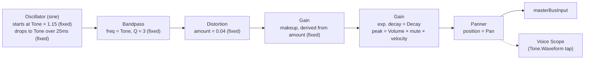

# Low Tom

`useLowTomVoice` (`useLowTomVoice.ts`) pairs with `LowTomPad`
(`LowTomPad.tsx`). A single sine oscillator with a short pitch-drop, tuned
by a bandpass filter and lightly saturated, driven by its own amplitude
envelope.

This voice's code is byte-for-byte identical to Hi Tom and Mid Tom aside
from its tone range/default — see [Notes](#notes).

## Signal flow

## Knobs

| Knob   | Range     | Controls                                                    |
| ------ | --------- | -------------------------------------------------------------- |
| Tone   | 80–100 Hz | Oscillator's settle frequency and the bandpass's center freq (tied together) |
| Decay  | 0.08–3s   | Envelope decay                                                  |
| Volume | 0–100%    | Envelope peak level                                             |
| Pan    | -100–100  | Stereo position                                                 |

## Notes

- **Pitch drop is fixed**: the oscillator always starts 1.15× above the
  Tone knob's value and glides down to it over a fixed 25ms — this ratio
  and timing aren't exposed.
- **Distortion is fixed and self-compensating**: a small (0.04) saturation
  amount, with its makeup gain computed via the shared
  `distortionMakeupGain` helper (`lib/distortionMakeupGain.ts`) rather than
  a hand-tuned constant — the same helper Hi Tom and Mid Tom use.
- **Same graph shape as Hi Tom/Mid Tom**: `useHiTomVoice.ts` and
  `useMidTomVoice.ts` are identical to this file except for their
  `TONE_MIN`/`TONE_MAX`/default-tone constants (165–220/190 and 120–160/140
  respectively, vs. this voice's 80–100/90). If you're changing this
  voice's structure, the other two tom voices almost certainly need the
  same change.
- **Per-hit node construction**: like every voice in this app, the full
  chain above is built fresh on each hit and disposed afterward.
