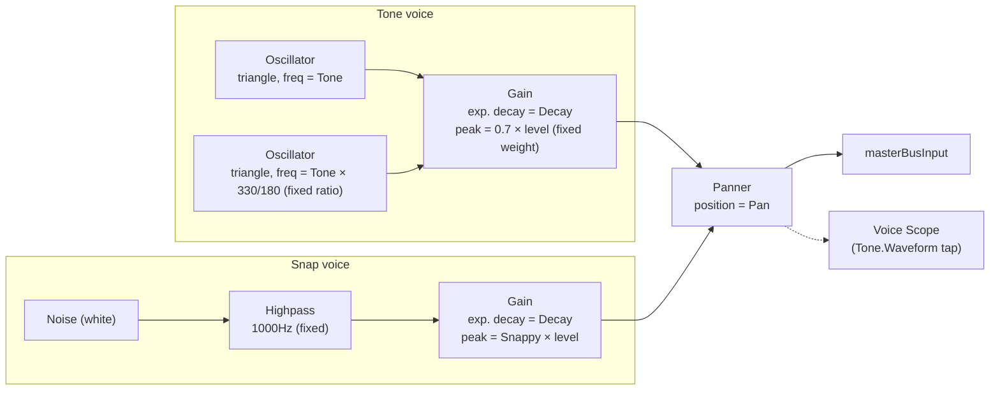

# Snare

`useSnareVoice` (`useSnareVoice.ts`) pairs with `SnarePad` (`SnarePad.tsx`).
Two parallel voices — a tonal "body" (two summed oscillators) and a noise
"snap" — each with their own envelope, summed only at the shared panner.
There's no shared tone-shaping stage downstream, unlike Kick/Clap.

## Signal flow

## Knobs

| Knob   | Range      | Controls                                                          |
| ------ | ---------- | ------------------------------------------------------------------ |
| Tone   | 100–300 Hz | Base frequency of both tone-voice oscillators (second osc follows at a fixed 330/180 ratio above it) |
| Snappy | 0–1        | Peak level of the noise/snap voice                                  |
| Decay  | 0.05–2s    | Exponential decay time, shared by **both** voices                   |
| Volume | 0–100%     | Applied as a fixed 0.7 weight on the tone voice and directly on the snap voice's peak |
| Pan    | -100–100   | Stereo position, shared by both voices                              |

## Notes

- **No shared output stage**: unlike Kick/Clap, there's no
  compressor/limiter/lowpass/highpass chain here — both voices go straight
  from their own envelope gain to the panner.
- **Fixed oscillator ratio**: `TONE_VOICE_RATIO = 330/180` preserves the
  interval between the two original fixed-frequency oscillators from the
  hand-tuned recipe this voice was built from, so turning the Tone knob
  transposes both oscillators together rather than changing their interval.
- **One Decay knob, two envelopes**: the same `decay` value drives both the
  tone voice's and the snap voice's exponential ramp — there's no separate
  "snap decay."
- **Per-hit node construction**: like every voice in this app, the full
  chain above is built fresh on each hit and disposed afterward.
